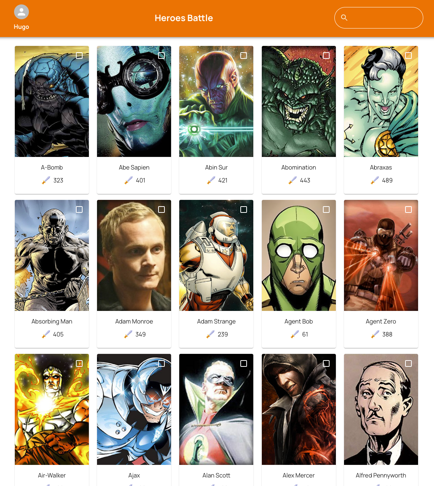

## Heroes Battle

 

### Tecnologias usadas

O projeto foi desenvolvido usando [React.js](https://react.dev/) e [Next.js](https://nextjs.org/)
junto com [Material UI](https://mui.com/) para estilizar a aplicação.

O gerenciamento de estados foi feito com o [Zustand](https://zustand-demo.pmnd.rs/) e as requisições de API com [Axios](https://axios-http.com/).

### License
© Done with a lot of &#10084; by Hugo Ramon Pereira -> [Portfolio](https://hugoramonpereira.dev/) -> [LinkedIn](https://www.linkedin.com/in/hugo-ramon-pereira/) 🇧🇷

